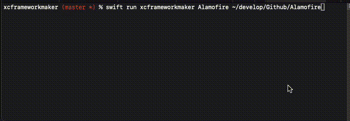

# xcframeworkmaker 

A simple command line utility to build an xcframework from a SwiftPM Library.

# Usage

Simply download the package and run:

```swift run xcframeworkmaker Alamofire /Path/To/Alamofire-master/```

It will create an `Alamofire.xcframework`.



## Build specific platforms

By default it will build for all platforms (iphoneos, iphonesimulator, macos, tvos, tvossimulator, watchos, watchossimulator)

```swift run xcframeworkmaker Scheme library/ --platforms ios --platforms macos```

It will automatically skip platforms that fail to build.

## Author

Christos Koninis, christos.koninis@gmail.com
